**SENG 438 - Software Testing, Reliability, and Quality**

**Lab. Report \#4 – Mutation Testing and Web app testing**

| Group \#:        |     |
| ---------------- | --- |
| Student Names:   |     |
| Maheen Raza      |     |
| Maham Jamal      |     |
| Mehrnaz Zafari   |     |
| Chloe Villaranda |     |

# Introduction

In the fourth assignment for SENG 438, we look at two different types of testing approaches.

The first type is known as mutation testing. This is known as fault-based testing, and is done by injecting mutants into our system and checking to see if our test suite is strong enough to kill these mutants, or if they still persist. This was done on our test suites that we have been working on from assignment 1 all the way through assignment 3 for the JFreeChart class.

The second type is known as web-based testing, which tends to be done by automatic tools like Selenium. In this assignment, web-based testing is done by recording tests on specific websites that all have similar functionalities, and then replaying those tests again to see if they will execute with no defects.

# Analysis of 10 Mutants of the Range class

## Mutant 1 - 90: Less or equal to equal (KILLED)


- The mutant changes the condition to lower == upper, meaning that if the lower bound is equal to the upper bound, an exception will be thrown.
- However, the original code intends to throw an exception when the lower bound is strictly greater than the upper bound, not when they are equal.
- If the test suite includes appropriate test cases to handle scenarios where the lower bound is strictly greater than the upper bound, it should not detect any deviation from the expected behavior introduced by this mutant.
- The changed behavior introduced by the mutant does not contradict the original specification, as it still conforms to the requirement that the lower bound must be less than the upper bound.

The test suite effectively detected the changed behavior introduced by the mutant and killed it.

## Mutant 2 - 157:Negated double field lower (SURVIVED)


- The original behavior of the intersects method is to determine if a given range (specified by b0 and b1) intersects with the range represented by the Range object.
  It does this by checking if b0 is less than or equal to the lower bound of the Range object, and if b1 is greater than the lower bound.

- Negating the lower field would change its sign. For example, if lower was originally 5.0, it would become -5.0 after the mutation. This mutation would invert the logic of comparisons involving lower. For instance, if b0 was previously required to be less than or equal to lower, it would now need to be greater than or equal to -lower (which is equivalent to -lower if lower is positive). Similarly, comparisons involving b1 and lower would also be affected.

- This mutant survived so the original test suite can be improved by adding test cases covering scenarios where the sign of lower is relevant. Test cases should cover various combinations of b0 and b1 relative to the original and mutated values of lower.

## Mutant 3 - 176: removed call to org/jfree/data/Range::getLowerBound() (SURVIVED)

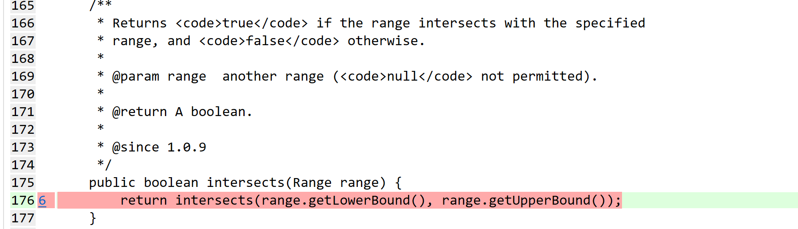

- By removing the call to getLowerBound(), the method no longer retrieves the lower bound of the specified range.
  As a result, it will always use the lower bound of the current Range object (this) when determining the intersection, instead of considering the lower bound of the specified range.
- This mutation effectively changes the behavior of the method, as it now incorrectly checks for intersection with the lower bound of the current Range object only.

- The original test suite did not detect this mutation. Test cases specifically designed to cover scenarios where the lower bound of the specified range is relevant. Test cases should include scenarios where the lower bound of the specified range is different from the lower bound of the current Range object to effectively detect the changed behavior introduced by this mutation.

## Mutant 4 - 305: removed call to org/jfree/data/Range::getLowerBound (KILLED)

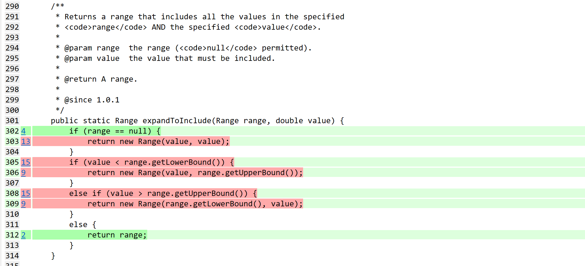

- Removing the call to getLowerBound() means that the method no longer retrieves the lower bound of the input range. As a result, the conditions value < range.getLowerBound() and value > range.getUpperBound() are no longer evaluated correctly. Without checking the lower bound, the method cannot accurately determine whether the specified value falls outside the range's bounds.
- This mutation likely results in incorrect behavior, potentially returning incorrect ranges or failing to expand the range when necessary.

The test suite effectively detected the changed behavior introduced by the mutant and killed it.

## Mutant 5 - 124: decremented (--a) double fieldupper (KILLED)

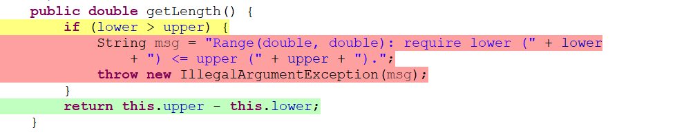

- In the original method getLength(), it calculates the length of the range by subtracting lower from upper. If lower is greater than upper, it throws an IllegalArgumentException.
- This mutant considers the senario where upper were decremented, which might result in a negative length if lower is still greater than the new value of upper. This could potentially lead to the code not throwing an exception when it should, or vice versa.
- since the mutant is killed, it indicated that the test suit is capable of detecting the mutation and ensuring the correct behavior of the method.

## Mutant 6 - 147: replaced double division by subtraction (KILLED)

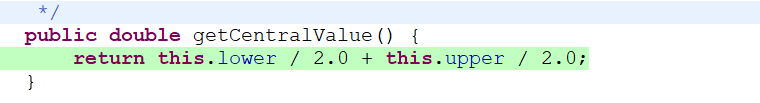

- The mutant "replaced double division by subtraction" suggests that instead of performing division by 2.0 to calculate the central value, subtraction is used.
- In the original method getCentralValue(), the central value is calculated by taking the average of lower and upper using division by 2.0. If the mutant replaces this division with subtraction, it might calculate the central value incorrectly, leading to incorrect results.
- since the mutant is killed, it indicated that the test suit is capable of detecting the mutation and ensuring the correct behavior of the method.

## Mutant 7 - 213: incremented (a++) double upper field(SURVIVED)

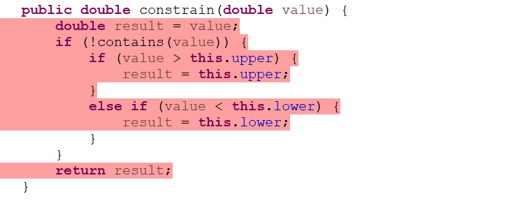

- the mutant is attempting to increment the upper field of the Range class within the constrain method.
- In the original method, the purpose is to ensure that the provided value falls within the range defined by lower and upper. If the value is outside this range, it is constrained to the nearest bound.
- If the mutant increments the upper field, it would shift the upper bound of the range upwards. This means that values previously considered out of range might now fall within the updated range.
- Since the mutant survived, it indicated that the test suit does not provide test cases to cover this senario.

## Mutant 8 - 247: not equal to equal (KILLED)

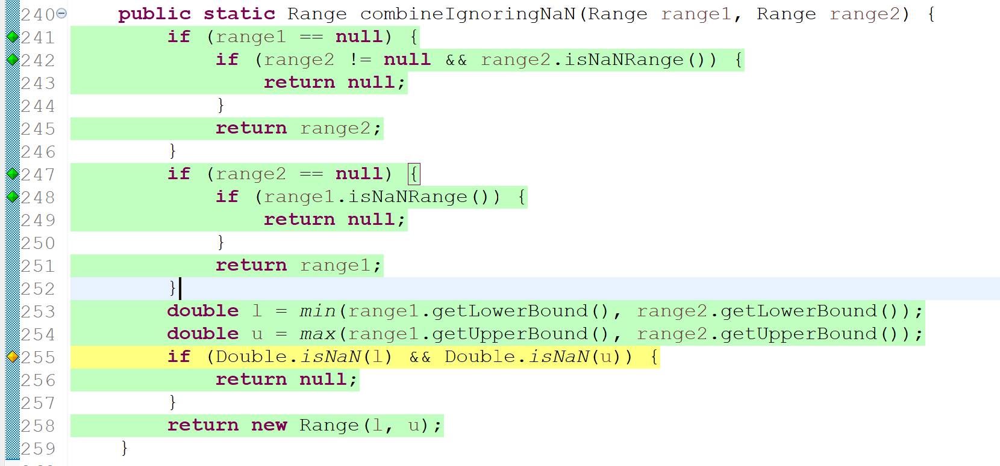

- Here, the mutant is changing the '!=' to '==' in the if condition "if (Double.isNaN(l) && Double.isNaN(u))"
- Now, this would alter the logic of the method 'combineIgnoringNaN'
- With this mutation, the condition would check if both 'l' and 'u' are equal to NaN and only return 'null' if both are NaN.
- This means that if either 'l' or 'u' is NaN but not both, the method would return a new 'Range' object with the NaN value.
- In the original method, the condition checks only if either 'l' or 'u' is NaN, and if so, it returns 'null' which ensures that only valid numeric ranges are returned.

## Mutant 9 - 305: Negated conditional (KILLED)

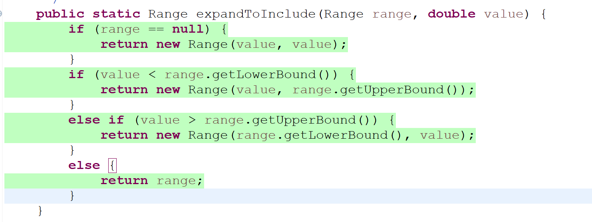

- This mutant negates the conditional in the if statement "if (value < range.getLowerBound())" which changes the logic of the method 'expandToInclude'
- It would check if the variable 'value' is not less that 'range.getLowerBound()' meaning that the condition would be true if 'value' is greater than or equal to 'range.getLowerBound()'

## Mutant 10 - 387: Substituted 0.0 with a 1.0 (SURVIVED)

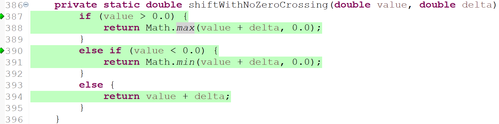

- This mutant substitutes 0.0 with a 1.0 in the code changing the method 'shiftWithNoZeroCrossing'
- Now the condition 'value > 0.0' would now check if 'value' is greater that '1.0'. Similarly, the condition 'value < 0.0' will now check if 'value' is less than '1.0'.
- This Change shifts the zero crossing point from 0.0 to 1.0 so it would prevent crossing from 1.0 instead of 0.0.
- Here, the mutation survived because the test cases used did not cover this specific scenerio.

# Report all the statistics and the mutation score for each test class

## RangeTest Class Stats - Original


## RangeTest Class Stats - New

## For DataUtilities

### Mutation Coverage and Statistics Prior to Writing New Tests:

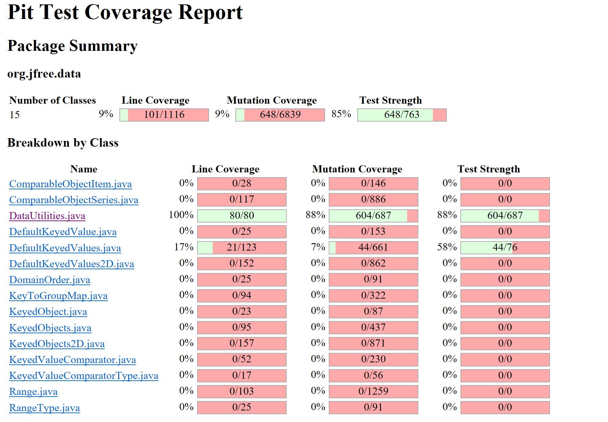
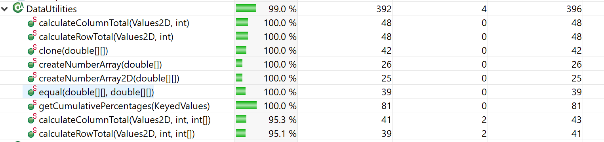
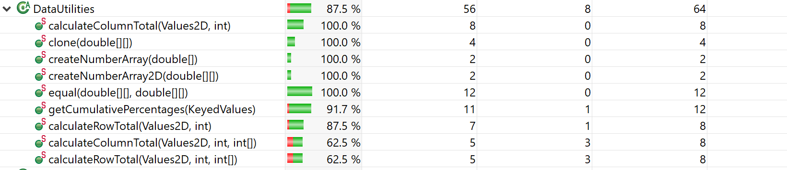
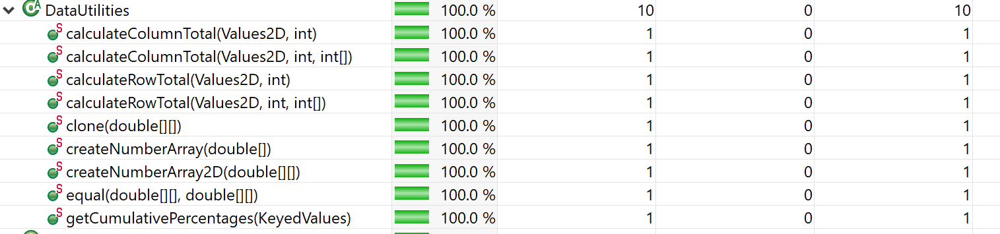

### Mutation Coverage and Statistics After Writing New Tests:

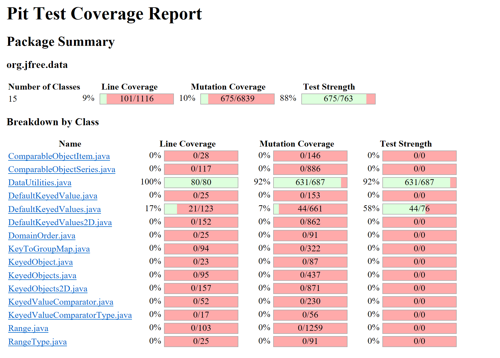
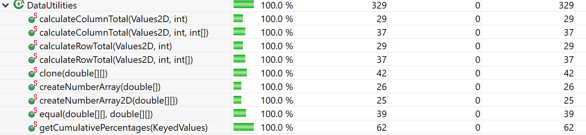
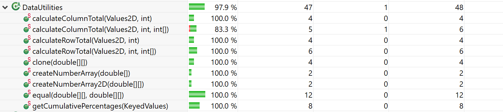
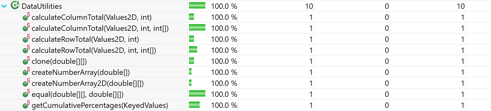

# Analysis drawn on the effectiveness of each of the test classes

## For DataUtilites

Looking at the test suite that was made for assignment 3, in terms of statement, method and branch coverage, the test suite did a good job in terms of overall coverage for all three. When I ran the PIT on the DataUtilities test suite, the initial, starting mutation coverage, before adding any new test cases, was already pretty high, starting at 88%. This, to me, indicates that the initial test suite developed from assignment 3 was effective in catching injected mutants into our SUT.

## For Range 

The test suite made for assignment 3 performed well in terms of statement, method, and branch coverage. Due to infeasible paths, we were unable to achieve significantly increased branch coverage. After running the PIT on the Range test suite, the initial mutation coverage was low at around 60% which indicated that the test suite created was not as robust as we had thought. We added tests for edge cases and ensured to test functions more rigorously which had many surviving mutants and were able to increase the coverage by approximately 10%. Overall, the test suite developed for Range from assignment 3 was effective to a moderate extent with significant room for improvement.

# A discussion on the effect of equivalent mutants on mutation score accuracy

Equivalent mutants have a large impact on the mutation score, as the mutation score tends to be lower due to the fact that picking up equivalent mutants using your test suite is a lot more difficult, since equivalent mutants cause the system to exhibit the same behavior as the system normally. For example, as we worked on DataUtilities, the original score was already high, at 88%, which was increased, but not to 98%, as it is difficult to increase the mutation coverage to such a high rate due to the presenece of equivalent mutants.

### For automatic detection:

Being able to detect equivalent mutants is important for testing, as it reduces the testing efforts we put into our system, as equivalent mutants result in the same behavior of the system as it was behaving before.

In order to detect a few equivalent mutants within your experimentation automatically is by using common mutation testing tools like the one we use in this lab, PIT. There are several benefits of using automatic tools for mutation testing, which include the following: using tools means that generating mutants is done automatically, which reduces time for the tester when it comes to generating mutants. The tool will also follow patterns, which will be helpful when generating systematic mutants. In terms of disadvantages, one key one is the computational cost of using automatic tools in order to detect equivalent classes. As I ran the PIT tool, it took around 30 minutes to execute, which can be hard for testers as it takes a lot of power from their machine.

### For manual detection:

To detect equivalent mutants manually, I did the following: I first understood what the mutant injected and ran through 2 test cases in my head. If the output of the method with the mutant injected is the same as the method with no changes, that indicates to me the presence of an equivalent mutant, which I can then ignore.

# A discussion of what could have been done to improve the mutation score of the test suites

## For DataUtilities

Since the mutation score initially was already so high, I knew it would be a challenge in order to increase the mutation coverage of DataUtilities. My first technique in order to do so was to write more tests for the calculateRowTotal and calulateColumnTotal with three arguments, and the equal() and clone() functions as well. Since these methods weren't thoroughly tested in assigment 4 as much, adding these additional test cases bumped up the overall mutation coverage.

For example, the line if (a.length != b.length) in the equal() method had injected mutants where the equality would change from != to <, >, <=, and >=. So I wrote test cases for the different scenarios where the length of a is greater than, less than and equal to the length of b, and vice versa. This increase the mutation coverage quite a bit.

Since the initial mutation coverage started at 88%, it was hard to get it up to 92%. Due to the presence of equivalent mutants, it isn't possible to get the coverage up to 98%, since equivalent mutants exhibit the same behavior as the original SUT.

## For Range

The starting point for the mutation score was low at 60%. Despite being low with lots of room for improvement, increasing the score was an incredibly challenging task. First, we identified methods with little to no coverage which had many surviving mutants and extended test cases for that. In particular, we added tests for the ```constrains()```, ```combiningIgnoringNaN()```, and ```intersects()```. These methods seemed to have been left out from our test suite so testing them rigorously increased the mutation coverage. Furthermore, we revised our test suite by removing redundant test cases in order to improve the overall quality and strength of our test suite. It was important to note that alot of the surviving mutants were indeed equivalent mutants hence making it more challenging to push the mutation coverage score further.

# Why do we need mutation testing? Advantages and disadvantages of mutation testing

Mutation testing is a technique that is used to evaluate the quality of software tests by introducing minor changes (mutants) to the code base and detecting whether the test suite succesfully detected these changes. Mutation testing is vital to evaluate and increase the robustness of a developed test suite.

## Advantages of Mutation Testing

Mutation testing is valuable as it allows developers to conduct a quality assessment of their test suite. A rigorous assessment is provided of test suites compared to traditional code coverage metrics. Weaknesses of a test suite are identfied through mutation testing as well and points developers in the right direction of what features and parts of the tests need an increase in coverage and robustness. Mutation testing also allows developers to feel confident in code changes as they are certain that their test suite is robust and will be able to pick up on unintended side effects when implementing new features or making changes to the codebase. Using mutation testing, we can detect more logical errors in the source code provided. For example, somewhere in your source code, you may be dividing two values a and b, but that might cause an issue if the value in the denominator were to be a zero. Due to this, implementing mutation testing will also increase the overall quality of your code, as your test suite will be edited to be much stronger when testing your system.

## Disadvantages of Mutation Testing

However, mutation testing also has several drawbacks. It is computationally expensive. For a smaller, less complex program this may not be an issue but as the code base grows and increases in complexity, it can serve as major issue, Generating anf running mutations for every line of code requires significant time and resources making this technique impractical in certain cases. Mutation testing can produce false positives and false negatives which may undermine the reliability of the testing process. Additonally, mutation testing requires a proficient test suite as if the existing suite is poorly written the results may not be meaningful. Finally, the maintence overhead may be difficult to manage as teams are required to invest time in setting up mutation testing frameworks, analyzing results, and addressing issues identified through mutation testing.

Something I learned with this assignment is that mutation testing is very time consuming. Writing tests to kill certain mutants can be hard, as you need to think of test suites that will detect a certain fault in the source code. Since we used an automation tool for this assignment, the tool would take a very long time to show the overall mutation report, around 30-40 minutes!

# Explain your SELENUIM test case design process

## Maheen:

In order to create and execute tests on the website "ebay", I first just thought of basic scenarios customers might go through when accessing the site.

## First test case design:

The first test case I thought of was testing the search functionality of the website. As someone that has used ebay and other online shopping websites before, the first thing customers tend to do is search for an item, without even logging in. So my first test case design consisted for the following steps:

1.  Access the ebay website
2.  Search for a specific item
3.  Wait for it to appear
4.  Click on an option

## Second test case design:

The second case design was to test the "add-to-cart" functionality that most online shopping sites tend to have. This test case directly connects to the first one, as customers will search for an item, select the item of their choosing, and then add the item to their cart. The second test case design consisted of the following steps:

1. Access the ebay website
2. Search for a specific item
3. Wait for it to appear
4. Click on an option
5. Select appropriate sizes/options
6. Click on the "add-to-cart" button
7. Click on the "cart" button in the top right corner
8. Double check cart with selected items

## Maham:

## First test case design:

Customers occasionally would want a more refined search to better fit their requirements in an item. Similar to the Search functionality, the test unit case designed has a customer using the advanced search likeso:

1.  From homepage, click on advanced next to the search bar
2.  Enter a keyword or item number
3.  Choose a keyword opton
4.  Exclude a word from a search
5.  Choose a category
6.  May click on the other filters
7.  Click on Search
8.  Item meeting all the requirements will appear

## Second test case design:

As customers may be on the fence about an item, they should be able to add an item of their interest to their watchlist in case they would like to purchase it at a later time for a maybe reduced price.
For this test case, the following steps are as follows:

1.  Go to an item page
2.  Click on Add to watchlist
3.  Click on watchlist at the very top
4.  Click on View all items you are watching
5.  Item that you have added will be displayed

## Chloe:

## First test case design:

I decided to do a straight-forward test case: the login. Most websites have a login feature where users are able to login to access a variety of things, mainly the items they have ordered, search history, profile details, etc. My test steps are as follows:

1.  Open the ebay website
2.  Click Sign-in at the top left
3.  Enter Login details: valid email/username and password
4.  Click sign in
5.  Verify user is logged in by checking account details

## Second test case design:

After logging in, I thought of another functionality that is important to a website: account management.

1.  Click on the user profile icon or username displayed on homepage
2.  Click on account settings
3.  Verify that account management is displayed, should see options relating to personal info, communication preferences, payment methods, etc.
4.  Update one of the settings
5.  Save changes
6.  Verify the changes are saved

## Mehrnaz:

## First test case design:

For the first test case, I tested adding an item to watchlsit.

1. Go the ebay website
2. Log in
3. Go to home page
4. Click on "HeadPhones"
5. Click on "Beats By Dr Dre"
6. Click on the "add-to-watchlist" button
7. Checked watchlist to make sure the added item is there

## Second test case design:

For the second test design, I tested deleting an item from the cart, which is a senario that happens alot.

1. Go the ebay website(already logged in)
2. Click on cart icon at the top right corner
3. Select "Remove" for the first item in the cart
4. Cart is updated with "item was removed from your car." message.

# Explain the use of assertions and checkpoints

When using Selenium to run tests for web-based applications, the use of the checkpoints are quite helpful in order to figure out which interactions with the web application the testing tools fails or struggles to capture. It also helps decipher the steps in order to perform specific tests, and if there are any defects or issues with the test case.

When using checkpoints, I did find some defects when executing the basic add-to-cart functionality, where it would abort after adding the item to the cart, but won't click on the cart to show what items are inside.

# how did you test each functionaity with different test data

## Maheen:

In order to test the two functionalities with different test data, I thought of common situations that customers might find themselves in when either using the search functionality or when adding an item into their cart.

## Search Functionality:

A common situation customers might find themselves in is accidently incorrectly spelling an item they are looking for. In order to create a test case for this scenario, I followed these steps:

1. Access the ebay website
2. Search for a specific item by incorrectly spelling it
3. Wait for it to appear
4. Click on an option

## Add-to-cart functionality:

In order to create test cases with different inputs for the add-to-cart functionality, I thought of when customers may try to add something to their cart with specifiying options like size, which consisted of the following steps:

1. Access the ebay website
2. Search for a specific item
3. Wait for it to appear
4. Click on an option
5. Click on the "add-to-cart" button
6. Click on the "cart" button in the top right corner
7. Check cart to see if its empty

Another test case is when customers try to select a size that is not available, which conisists of the following steps:

1. Access the ebay website
2. Search for a specific item
3. Wait for it to appear
4. Click on an option
5. Click on an unavailable size

## Maham:

## First functionality tested

As there are lots of conditions that could be added onto a conditional search, these test cases test some of the variants that can happen when using the advanced search function:

Valid Search:

1.  From homepage, click on advanced next to the search bar
2.  Enter "Waterbottle" as a keyword
3.  Click Search
4.  Should view listings for multiple water bottles

Invalid Search:

1.  From homepage, click on advanced next to the search bar
2.  Enter "Waterbottle" as a keyword
3.  Enter "Waterbottle" in the "Exclude words from your search"
4.  Expect to be directed to a "No exact matches found" page

Valid Search with multiple conditions:

1.  From homepage, click on advanced next to the search bar
2.  Enter "Waterbottle" as a keyword
3.  Choose the 'Travel' category in the category tabs
4.  Click Search
5.  Should view listings for multiple water bottles
6.  Set min price to $5
7.  Set max price to $15
8.  Checkmark condition to 'New'
9.  Waterbottles from the price range of $5 - $15 that are marked as brand new should be displayed

## Second functionality tested

To expand on the test case design for the watchlist, multiple actions that tested the limitations of the functionality were conducted and the steps are as follows:

Adding one item to watchlist:

1.  Go to an item page
2.  Click on Add to watchlist
3.  Click on watchlist at the very top
4.  Click on View all items you are watching
5.  Item that you have added will be displayed

Adding three items to watchlist:

1.  Go to an item page
2.  Click on Add to watchlist
3.  Go to another item
4.  Click on Add to watchlist
5.  Go to another item
6.  Click on Add to watchlist
7.  Click on watchlist at the very top
8.  Click on View all items you are watching
9.  3 Items should be displayed

Removing an item from the watchlist:

1.  In the navigator bar, hover over 'My eBay' and click on 'Watch List'
2.  Click on the checkbox for an item
3.  Click Delete
4.  Item should no longer be listed on the Watchlist

## Chloe:

## First functionality tested

For login, there are multiple different possible data sets.

Valid User:

1.  Click on Sign-in at the top
2.  Enter Email or username
3.  Enter Password
4.  Be redirected to the mainpage of ebay

Invalid User:

1.  Click on Sign-in at the top
2.  Enter invalid Email or username
3.  Enter password
4.  Be redirected to the Get help signing in page

Using Google authentication:

1.  Click on Sign-in at the top
2.  Click on Continue with Google
3.  Choose account
4.  Be redirected to the mainpage of ebay

## Second functionality tested

As there are multiple different features that a user can update on their account, I have come up with the following test cases:

Update E-mail Address:

1.  Hover over "Hi {Your Name}!" in the upper left
2.  Click on Account Settings
3.  Click on Personal information
4.  If prompted, click on sign in to continue. Click on skip for now if prompted passkey
5.  Click edit on the email address
6.  Change the email
7.  Click Save

Update Personal info/Address:

1.  Hover over "Hi {Your Name}!" in the upper left
2.  Click on Account Settings
3.  Click on Personal information
4.  If prompted, click on sign in to continue. Click on skip for now if prompted passkey
5.  Click edit on Personal info
6.  Change the Street Address
7.  Click Save
8.  Updated successfully

Likewise there are multiple things to change and adding test cases for all would be too much. So here, only two examples are given.

## Mehrnaz

## First functionality tested

Filtering is another common senario that customers use, in order to find their desired items faster and more convenient. In order to test filtering functionality, I did the following steps:

1. Search for an item in search bar (I searched "beats")
2. Click on condition and press "open box"
3. Click on item location and press "Canada only"
4. Click on "Red" in color section
5. Keep sort by its default value "Best Match"
6. Wait for the update
7. Update successfully and items with the selected filters show up

## Second functionality tested

Another feature that helps customers resumes their shopping from where they left off is "Recently Viewed". In order to test this feature:

1. Click on Sign-in at the top
2. Click on Continue with Google
3. Choose desird email address to sign in with
4. Hover over "My eBay" on the right corner of the screen
5. From the options, click on "Recently Viewed"
6. After the page refreshed, viewed items apear on the screen.

# Discuss advantages and disadvantages of Selenium vs. Sikulix

## Maheen:

After using Selenium for the very first time for this assignment, I have found the following advantages and disadvantages. Here are my advantages.

1. Easy to download, use and understand.
2. The steps to create a script are straightforward, and it's simple to record scripts.
3. The idea of using a chrome extension to create and execute web-based tests is attractive.

The following are my disadvantages:

1. Causes my laptop and website to glitch.
2. Everytime you create a new test case, instead of automatically saving the file, it makes you download it everytime.
3. The UI is not the best, sometimes glitches and acts strangely.
4. Using a chrome extension causes chrome to be slower.

Personally, I've never had experience with the alternative testing tool known as "Sikulix", so I cannot guage an opinion on it's testing abilities in compartsion to Selenium.

## Maham:

Selenium was a positive experience. It was easy to record the tests in a very straight forward nature. The UI was very intuitive and easy to manage as well. It was relatively fast to record and add new tests. I liked that it was possible to edit the tests after recording them as I was able to delete any accidental clicks/unwanted steps. This also made it less tedious and enjoyable to use. Initially, however, I struggled with using the application as when I recorded the test and ran it, it would crash before proceeding to the next step. I was able to resolve this by increasing the time between steps. I have never used "Sikulix" so cannot offer a valid or fair comparison between the two testing softwares. 

## Chloe:

Using Selenium was very interesting for this assignment. I liked the recording feature and how whenever you click on something, it would automatically record the steps you took to get there. Also it was easy to reporoduce the tests as you can press the play button and it will do the steps again.

For this assignment, only Selenium was utilized so I had no oppurtunities to experience Sikulix. Because of this fact, no comparison can be made between the two.

## Mehrnaz

I found Selenium fairly easy to install and work with. Tests and recording could be done with only a few clicks.
I experienced some glitches while running the recorded tests, and I had to restart my laptop, in order to reopen the project. The recorded tests sometimes failed, but I was able to run them completely, usually on the second try.
Like my teammates, I did not work with Sikulix for this assignment and did not have any previous experience.
Hence, I am not able to provide a comparison between them.

# How the team work/effort was divided and managed

For Mutation testing, we evenly split the analysis of the mutants produced by Pitest amongst ourselves as well as explain the mutations and whether they were killed or not. We all spent the time to learn the technologies required as well as gain a proficiency in Mutation testing. We all modified the code to the best of our abilities.

For the GUI testing portion part of the assignment, each member did their required 2 recorded cases as well as individually explain their test case designs.

Also, every member contributed to the completion of the lab report.

# Difficulties encountered, challenges overcome, and lessons learned

Similar with the previous assignments, we had to learn how to do a different type of testing: mutation testing. We were introduced to new technologies such as Selinium and PIT Tests and learn how to analyze the results we got from the PIT summary. This was a learnign curve but eventually with the help of TAs, classmates, the internet, as well as time commitment, we were able to overcome this hurdle.

To increase our coverages with the mutations, we either had to modify or add new test cases that addressed the certain bahviours of the methods that were not originally covered to kill off any mutants. The process itself was very arduous as we had to run the PIT tests multiple times for every change we made and the time it took to complete one of the tests was excrutiatingly long and frustrating.

# Comments/feedback on the lab itself

The PIT part of the lab was quite difficult to get through, as executing mutation tests to a long time on my laptop. 
