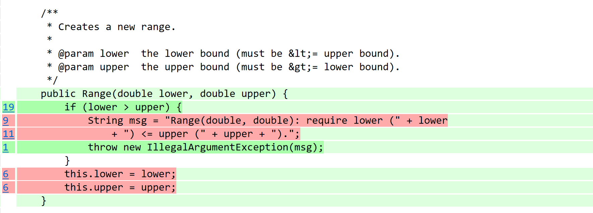
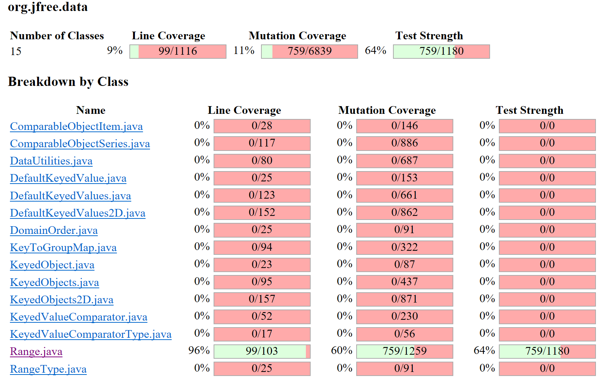

**SENG 438 - Software Testing, Reliability, and Quality**

**Lab. Report \#4 – Mutation Testing and Web app testing**

| Group \#:      |     |
| -------------- | --- |
| Student Names: |     |
| Maheen Raza    |     |
| Maham Jamal    |     |
|                |     |

# Introduction

In the fourth assignment for SENG 438, we look at two different types of testing approaches.

The first type is known as mutation testing. This is known as fault-based testing, and is done by injecting mutants into our system and checking to see if our test suite is strong enough to kill these mutants, or if they still persist. This was done on our test suites that we have been working on from assignment 1 all the way through assignment 3 for the JFreeChart class.

The second type is known as web-based testing, which tends to be done by automatic tools like Selenium. In this assignment, web-based testing is done by recording tests on specific websites that all have similar functionalities, and then replaying those tests again to see if they will execute with no defects.

# Analysis of 10 Mutants of the Range class

## Mutant 1 - 90: Less or equal to equal (KILLED)

- The mutant changes the condition to lower == upper, meaning that if the lower bound is equal to the upper bound, an exception will be thrown.
- However, the original code intends to throw an exception when the lower bound is strictly greater than the upper bound, not when they are equal.
- If the test suite includes appropriate test cases to handle scenarios where the lower bound is strictly greater than the upper bound, it should not detect any deviation from the expected behavior introduced by this mutant.
- The changed behavior introduced by the mutant does not contradict the original specification, as it still conforms to the requirement that the lower bound must be less than the upper bound.

The test suite effectively detected the changed behavior introduced by the mutant and killed it.

## Mutant 2 - 157:Negated double field lower (SURVIVED)

The original behavior of the intersects method is to determine if a given range (specified by b0 and b1) intersects with the range represented by the Range object.
It does this by checking if b0 is less than or equal to the lower bound of the Range object, and if b1 is greater than the lower bound.

Negating the lower field would change its sign. For example, if lower was originally 5.0, it would become -5.0 after the mutation. This mutation would invert the logic of comparisons involving lower. For instance, if b0 was previously required to be less than or equal to lower, it would now need to be greater than or equal to -lower (which is equivalent to -lower if lower is positive). Similarly, comparisons involving b1 and lower would also be affected.

This mutant survived so the original test suite can be improved by adding test cases covering scenarios where the sign of lower is relevant. Test cases should cover various combinations of b0 and b1 relative to the original and mutated values of lower.

## Mutant 3:

## Mutant 4:

## Mutant 5:

## Mutant 6:

## Mutant 7:

## Mutant 8:

## Mutant 9:

## Mutant 10:

# Report all the statistics and the mutation score for each test class

## RangeTest Class Stats - Original

#### Statistics from Console

> > Line Coverage: 102/57229 (0%)
> > Generated 358334 mutations Killed 767 (0%)
> > Mutations with no coverage 357143. Test strength 64%
> > Ran 64095 tests (0.18 tests per mutation)

# Analysis drawn on the effectiveness of each of the test classes

# A discussion on the effect of equivalent mutants on mutation score accuracy

# A discussion of what could have been done to improve the mutation score of the test suites

# Why do we need mutation testing? Advantages and disadvantages of mutation testing

Mutation testing is a technique that is used to evaluate the quality of software tests by introducing minor changes (mutants) to the code base and detecting whether the test suite succesfully detected these changes. Mutation testing is vital to evaluate and increase the robustness of a developed test suite.

## Advantages of Mutation Testing

Mutation testing is valuable as it allows developers to conduct a quality assessment of their test suite. A rigorous assessment is provided of test suites compared to traditional code coverage metrics. Weaknesses of a test suite are identfied through mutation testing as well and points developers in the right direction of what features and parts of the tests need an increase in coverage and robustness. Mutation testing also allows developers to feel confident in code changes as they are certain that their test suite is robust and will be able to pick up on unintended side effects when implementing new features or making changes to the codebase.

## Disadvantages of Mutation Testing

However, mutation testing also has several drawbacks. It is computationally expensive. For a smaller, less complex program this may not be an issue but as the code base grows and increases in complexity, it can serve as major issue, Generating anf running mutations for every line of code requires significant time and resources making this technique impractical in certain cases. Mutation testing can produce false positives and false negatives which may undermine the reliability of the testing process. Additonally, mutation testing requires a proficient test suite as if the existing suite is poorly written the results may not be meaningful. Finally, the maintence overhead may be difficult to manage as teams are required to invest time in setting up mutation testing frameworks, analyzing results, and addressing issues identified through mutation testing.

# Explain your SELENUIM test case design process

## Maheen:

In order to create and execute tests on the website "ebay", I first just thought of basic scenarios customers might go through when accessing the site.

## First test case design:

The first test case I thought of was testing the search functionality of the website. As someone that has used ebay and other online shopping websites before, the first thing customers tend to do is search for an item, without even logging in. So my first test case design consisted for the following steps:

1.  Access the ebay website
2.  Search for a specific item
3.  Wait for it to appear
4.  Click on an option

## Second test case design:

The second case design was to test the "add-to-cart" functionality that most online shopping sites tend to have. This test case directly connects to the first one, as customers will search for an item, select the item of their choosing, and then add the item to their cart. The second test case design consisted of the following steps:

1. Access the ebay website
2. Search for a specific item
3. Wait for it to appear
4. Click on an option
5. Select appropriate sizes/options
6. Click on the "add-to-cart" button
7. Click on the "cart" button in the top right corner
8. Double check cart with selected items

## Maham:

## First test case design:

## Second test case design:

# Explain the use of assertions and checkpoints

When using Selenium to run tests for web-based applications, the use of the checkpoints are quite helpful in order to figure out which interactions with the web application the testing tools fails or struggles to capture. It also helps decipher the steps in order to perform specific tests, and if there are any defects or issues with the test case.

When using checkpoints, I did find some defects when executing the basic add-to-cart functionality, where it would abort after adding the item to the cart, but won't click on the cart to show what items are inside.

# how did you test each functionaity with different test data

## Maheen:

In order to test the two functionalities with different test data, I thought of common situations that customers might find themselves in when either using the search functionality or when adding an item into their cart.

## Search Functionality:

A common situation customers might find themselves in is accidently incorrectly spelling an item they are looking for. In order to create a test case for this scenario, I followed these steps:

1. Access the ebay website
2. Search for a specific item by incorrectly spelling it
3. Wait for it to appear
4. Click on an option

## Add-to-cart functionality:

In order to create test cases with different inputs for the add-to-cart functionality, I thought of when customers may try to add something to their cart with specifiying options like size, which consisted of the following steps:

1. Access the ebay website
2. Search for a specific item
3. Wait for it to appear
4. Click on an option
5. Click on the "add-to-cart" button
6. Click on the "cart" button in the top right corner
7. Check cart to see if its empty

Another test case is when customers try to select a size that is not available, which conisists of the following steps:

1. Access the ebay website
2. Search for a specific item
3. Wait for it to appear
4. Click on an option
5. Click on an unavailable size

## Maham:

## First functionality tested

## Second functionality tested

# Discuss advantages and disadvantages of Selenium vs. Sikulix

## Maheen:

After using Selenium for the very first time for this assignment, I have found the following advantages and disadvantages. Here are my advantages.

1. Easy to download, use and understand.
2. The steps to create a script are straightforward, and it's simple to record scripts.
3. The idea of using a chrome extension to create and execute web-based tests is attractive.

The following are my disadvantages:

1. Causes my laptop and website to glitch.
2. Everytime you create a new test case, instead of automatically saving the file, it makes you download it everytime.
3. The UI is not the best, sometimes glitches and acts strangely.
4. Using a chrome extension causes chrome to be slower.

Personally, I've never had experience with the alternative testing tool known as "Sikulix", so I cannot guage an opinion on it's testing abilities in compartsion to Selenium.

## Maham:

# How the team work/effort was divided and managed

# Difficulties encountered, challenges overcome, and lessons learned

# Comments/feedback on the lab itself

The PIT part of the lab was quite difficult to get through, as executing mutation tests to a long time on my laptop.
